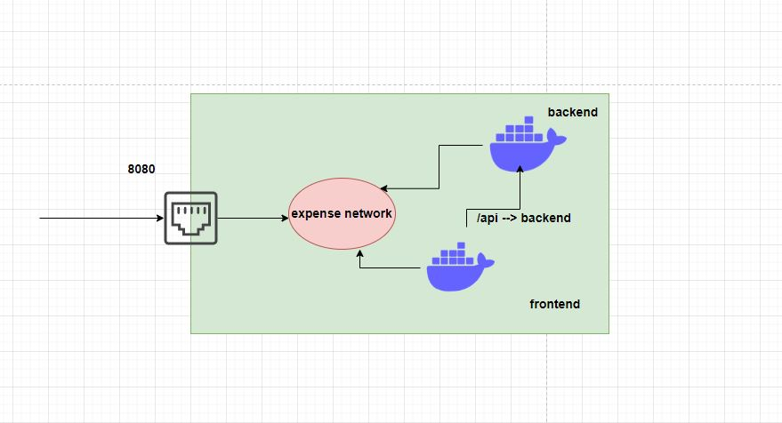

Database is created first. we should load default data. 

docker run -d -p 3306:3306 --name mysql --network expense mysql:1.0
docker run -d -p 8080:8080 --name backend --network expense backend:1.0

you can check logs using
docker logs mysql
docker logs backend

TO test if backend connected to mysql or not 

docker exec -it backend bash
check mysql (if not there)
check os --> cat /etc/*release
apt update
apt install -y default-mysql-client
mysql -h mysql -u root -pExpenseApp@1

troubleshooting:
curl http://localhost:8080/transaction

docker run -d -p 8080:8080 --name backend --network expense backend:1.0

we are saying, if user send any request on server port 8080, it will go through expense network and forward to backend container.

so if we do curl http://localhost:8080/transaction, we get success in container as well as in server.
also we can hit from browser <ip-address>:8080/transaction.
As above is not safe, we did docker run -d --name backend --network expense backend:1.0
Now we can access only in container. so its upto us how we want to expose and not expose.

frontend:
docker build -t frontend:1.0 .
docker run -d -p 80:80 --name frontend --network expense frontend:1.0
nginx home directory: /etc/nginx/

